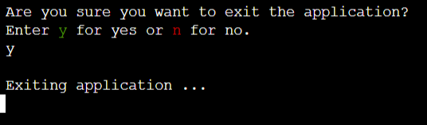

# [MASTERMIND](https://mastermind-python-game-abfdb9163a4b.herokuapp.com)

This website provides a Mastermind game in form of a Python console game. It is presented in a mock terminal in the browser.

Mastermind is a classic game where the objective is to guess a secret code consisting of a specific number of colors. The colors are represented by numbers in this game. After each guess the user receives feedback. They take the feedback into account to make a new guess until the code is cracked or a maximum number of attempts is reached. Three distinct difficulty levels are available in this game.

Please view the live site here - [Mastermind](https://mastermind-python-game-abfdb9163a4b.herokuapp.com)

source: [amiresponsive](https://ui.dev/amiresponsive?url=https://mastermind-python-game-abfdb9163a4b.herokuapp.com)

## User Experience - UX

### Target Audience

This game is designed for anyone who wishes to play a single player game that requires some analytical thinking and problem solving skills. Due to the different difficulty levels the game is suitable to beginners as well as advanced mastermind players. Because it is a console game, most likely it will appeal more to people who are more used to working on computers. Also the site is not well suited for mobile devices and users will most likely acces it from a laptop or desktop.

### User Stories

- As a user, I would like to play a game of mastermind that is functional and easy to control.
- As a user, I would like to choose a difficulty level.
- As a user, I would like to get clear information on the secret code specifications.
- As a user, I would like to receive clear feedback in case a guess is not valid.
- As a user, I would like to receive clear feedback on how close my guess is to the secret code.
- As a user, I would like to clearly see when I have lost a game.
- As a user, I would like to clearly see when I won a game.
- As a user, I would like to be able to exit the game when I want to.
- As a user, I would like to avoid to accidentally quit the game.
- As a user, I would like to be able to access game instructions.
- As a user, I would like to be able to select a plain text mode to bypass any visual elements.

### Colour Scheme

I used the [colorama](https://pypi.org/project/colorama/) module to add font color to the application. I used the following colors:

- Blue for the logo and to highlight the word Mastermind
- Cyan to highlight important information
- Red for error messages, the last round warning and the lose message
- Green, Yellow and Red to indicate the levels Easy, Classic and Hard respectively
- Magenta for subheadings in the instructions page
- Green for hits and yellow for close on the board
- Blue, cyan, red, green, yellow, magenta for the code guesses and secret code

## Features

### Existing Features

| Feature | Description | Screenshot |
| --- | --- | --- |
| **Start Screen** | Upon page load a start screen with only plain text is displayed. The user has the option to select whether to start the application in plain text mode or not. Plain text mode means that all visual elements, like ascii art or formatted tables are avoided. This is most important for screen readers.  |  |
| **Plain Text Mode** | When plain text mode is selected, all visual elements will be avoided throughout the application. A confirmation that this mode was selected is displayed on the screen and the user can press ENTER to continue to the game. |  |
| **Logo** | The logo appears on top of the terminal and uses an Ascii art font from the [pyfiglet](https://pypi.org/project/pyfiglet/) module. The goal is to prominently display the game name. It has a clean and futuristic look which fits with the game of this logic terminal game.  |  |
| **Plain Text Logo** | In plain text mode the logo is just 'MASTERMIND' in bright blue font.  |  |
| **Game Menu** | After the viewing mode is selected a game menu is displayed, where the user can choose between three options, 'Play Game', 'Show Instructions' or 'Exit'.  |  |
| **Instructions** | When the user selects option 2 in the game menu game instructions are displayed and can be closed again by pressing ENTER. If the user presses ENTER the game menu will be displayed again. The instructions describe the game and give details about the objective, rules, levels, feedback, winning, tips and how to exit the game.  |  |
| **Exit from Menu** | When the user selects option 3 in the game menu an exit confirmation is displayed before the console is cleared and a good bye message is shown. The application is terminated. |   |
| **Level Menu** | When the user selects option 1 in the game menu another menu, the level menu is displayed. There are three distinct difficulty level options to choose from. Level 1 or Easy, level 2 or Classic and level 3 or Hard. Once the user chooses a level, a confirmation is shown before the respective game starts. Note that the number and secret code specification of the difficulty levels can easily be changed in the program code.   In level 1 - Easy - the secret code consists of 3 digits between 1 and 4 and repetitions are allowed. In level 2 - Classic - the secret code consists of 4 digits between 1 and 6 and repetitions are also allowed. This is the same as many of the classic mastermind boardgames. Finally, in level 3 - Hard - the code consists of 5 digits between 1 and 8 and repetitions are not allowed. Each level has 12 rounds. |  |
| **Level Introduction** | When the user selects a level in the level menu, a page with details about the selected level is displayed. The user can continue to the game by pressing ENTER. |  |
| **Main Game Page** | Now the main game starts. The main game page contains everything that is relevant to play the mastermind game. It displays the logo, a description of the secret code, the round that the user is currently in, the game board and the input field for the user's next guess. |  |
| **Plain Text Main Game Page** | The main game page in plain text mode features the plain text logo and plain text board.  |  |
| **Secret Code description** | On top of the page, just below the logo, a description of the secret code is provided. This is for the users convenience so they do not have to memorize the specifications of the code for their chosen level. The secret code consists of a number of colors, which are here represented by numbers. The description states how many digits are in the code and what the minimum and maximum values allowed are. It also states whether color repetitions are allowed or not and how many rounds one has to crack the code. Note that the program code is generalised so that it is easy to use different characters (e.g. letters) representing the colors in the secret code. |  |
| **Round Display** | Below the code description the current round is displayed. |  |
| **Board** | The board is the main feature in the mastermind game, it represents a physical mastermind game. The user's guess from all previous rounds is displayed together with the feedback. The feedback consists of hits, the number of colors (represented by numbers) that are correct in color and position, and close, the number of colors that are correct in color but wrong in position.  This is the same as in the classical board game. The numbers in the guesses are printed in different colors which is reminiscent of the colors they represent. Note, that some of the colors repeat for two numbers, because colorama has a limited number of colors available. The hits and close are colored in green and yellow respectively.  The user can then use this feedback to improve their guess in the next round. |  |
| **Plain Text Board** | In plain text mode, the nicely formatted table is avoided and the board is printed in as rows of plain text. The colors are the same. |  |
| **Guess Input** | Each round, the user can make a guess as to what the secret code is. The guess is in put in an input field, validated for the correct length, characters and repetitions or not. |  |
| **Last Round Warning** | When the user has reached the last round of the game, a warning shows before the input is taken. So the user is aware that this is their last try to crack the code. |  |
| **Game Won** | When the user has cracked the code (i.e. all numbers in the code are hits) they have won the game! A win message is displayed together with the board, so that the user can see what guesses they took along the way to crack the code. After pressing ENTER the game menu displays again. Sreenshots of examples of win messages in standard and plain text mode are available on the right. |  |
| **Game Lost** | When the user does not correctly guess the secret code in the last round, the game is lost. A lose message is shown together with the board and the secret code is displayed as well. After pressing ENTER the game menu displays again. Examples for lose messages in standard and plain text mode are available on the right. |  ||
| **Exit Game** | To exit the game the user can enter "exit" in an input field at any point in the application. This allows the user to exit the app even when not in the main game menu. When "exit" is entered the user is shown an exit confirmation request (see below). |  |
| **Catch KeyboardInterrupt** | Normally, when a user presses Crtl+C on the keyboard, a KeyboardInterrupt error is raised and the application terminates. This is not wanted in the live site, therefore these errors are caught in the code and the user is shown the exit confirmation request (see below). This is relevant as users who are familiar with terminal commands might try and press Crtl+C to exit the app and this gives them a controlled way to exit. Other users might press Crtl+C to copy something from the terminal and this avoids them crashing the app. |  |
| **Exit Confirmation** | The exit confirmation request asks the user whether they really want to exit the app. If they choose yes, an exit confirmation followed by a good bye message is displayed and the app is terminated, otherwise a continuation message is shown and the program continues to run. |  |

### Future Features

- A useful future feature would be for the user to be able to quit a game without having to quit the entire application. They could open the menu and for example start a game of different level.

- It would also be interesting to add the option to show and hide instructions throughout playing without quitting the game.

## Tools & Technologies Used

-  used to generate README and TESTING templates.
-  used for version control. (`git add`, `git commit`, `git push`)
-  used for secure online code storage.
-  used as a cloud-based IDE for development.
-  used as the back-end programming language.
-  used for hosting the deployed back-end site.
-  used to help write the game instructions.
- [Mermaid](https://mermaid.live/) live editor used for creating the flowchart.
- [Code to Flowchart](https://codetoflow.com/) used for creating the UML class diagram and to help describe it.

## Project Structure and Requirements

### Flowchart

To follow best practice, a flowchart was created for the app's logic and mapped out before coding began using the [Mermaid](https://mermaid.live/) live editor.

Below is the flowchart of the main process of this Python program. For better readability the entire cycle of the program is mapped out in three subgraphs. The first subgraph (Screen) describes the start screen and plain text mode request. The second one (RunMenu) describes the part of the program which handles the main game menu up to the point where the game starts. Finally, the third subgraph (RunGame) describes the logic of the main game loop.

### OOP - Class Diagram

This project was developed using object oriented programming (OOP). The classes used in this program are mapped out in the below UML (Unified Modeling Language) class diagram. This diagram describes what each class does, which makes it easier to understand the code and extend or adapt it later. Each class is shown together with it's instance attributes (above the dashed line) and the class methods (below the dashed line). The + and - indicate public or private visibility. The arrows indicate associations between the classes, i.e. that one class makes reference to another. Finally, the number ones decorating the arrows indicate the multipicity of the association relationship, i.e. in this case, exactly one instance of one class is referenced in the one instance of the other.

I created the UML diagram using [Code to Flowchart](https://codetoflow.com/), which also helped with the descriptions below the diagram:

The main purpose of the classes used in this program are:

1. The `Screen` class handles many of the user interface and console interactions, such as clearing the screen, taking user input, requesting plain text mode or not, and printing different messages.

2. The `GameMenu` class is responsible for displaying the main game menu and handling the user's menu choices.

3. The `ChooseLevel` class  is responsible for displaying the level menu, handling the user's choice and initialise the corresponding game.

4. The `Game` class encapsulates the core game logic, including setting up the game level, creating the secret code, and managing the game loop.

5. The `Guess` class handles the user's guesses, validating them, and calculating the score.

6. The `Board` class manages the display of the game board either in plain text mode or not, showing the user's guesses and the corresponding scores.

The relationships between the classes are as follows:

- The `Game` class has dependencies on the `Screen`, `Guess`, and `Board` classes.
- The `GameMenu`, `ChooseLevel`, `Guess` and `Board` classes all have a dependency on the `Screen` class.

### Imports

I have used the following Python packages and external imported packages.

- `random`: used to get a random choice from a list
- `time`: used for adding time delays
- `tabulate`: used to nicely format a table for printing
- `pyfiglet`: used to create an ascii art logo
- `colorama`: used for including color in the terminal

## Testing

> [!NOTE]  
> For all testing, please refer to the [TESTING.md](TESTING.md) file.

## Deployment

Code Institute has provided a [template](https://github.com/Code-Institute-Org/python-essentials-template) to display the terminal view of this backend application in a modern web browser.
This is to improve the accessibility of the project to others.

The live deployed application can be found deployed on [Heroku](https://mastermind-python-game-abfdb9163a4b.herokuapp.com).

### Heroku Deployment

This project uses [Heroku](https://www.heroku.com), a platform as a service (PaaS) that enables developers to build, run, and operate applications entirely in the cloud.

Deployment steps are as follows, after account setup:

- Select **New** in the top-right corner of your Heroku Dashboard, and select **Create new app** from the dropdown menu.
- Your app name must be unique, and then choose a region closest to you (EU or USA), and finally, select **Create App**.
- From the new app **Settings**, click **Reveal Config Vars**, and set the value of KEY to `PORT`, and the value to `8000` then select *add*.
- If using any confidential credentials, such as CREDS.JSON, then these should be pasted in the Config Variables as well.
- Further down, to support dependencies, select **Add Buildpack**.
- The order of the buildpacks is important, select `Python` first, then `Node.js` second (if they are not in this order, you can drag them to rearrange them).

Heroku needs three additional files in order to deploy properly.

- requirements.txt
- Procfile
- runtime.txt

You can install this project's **requirements** (where applicable) using:

- `pip3 install -r requirements.txt`

If you have your own packages that have been installed, then the requirements file needs updated using:

- `pip3 freeze --local > requirements.txt`

The **Procfile** can be created with the following command:

- `echo web: node index.js > Procfile`

The **runtime.txt** file needs to know which Python version you're using:
1. type: `python3 --version` in the terminal.
2. in the **runtime.txt** file, add your Python version:
	- `python-3.9.19`

For Heroku deployment, follow these steps to connect your own GitHub repository to the newly created app:

Either:

- Select **Automatic Deployment** from the Heroku app.

Or:

- In the Terminal/CLI, connect to Heroku using this command: `heroku login -i`
- Set the remote for Heroku: `heroku git:remote -a app_name` (replace *app_name* with your app name)
- After performing the standard Git `add`, `commit`, and `push` to GitHub, you can now type:
	- `git push heroku main`

The frontend terminal should now be connected and deployed to Heroku!

### Local Deployment

This project can be cloned or forked in order to make a local copy on your own system.

For either method, you will need to install any applicable packages found within the *requirements.txt* file.

- `pip3 install -r requirements.txt`.

If using any confidential credentials, such as `CREDS.json` or `env.py` data, these will need to be manually added to your own newly created project as well.

#### Cloning

You can clone the repository by following these steps:

1. Go to the [GitHub repository](https://github.com/theresaabl/mastermind).
2. Locate the Code button above the list of files and click it.
3. Select if you prefer to clone using HTTPS, SSH, or GitHub CLI and click the copy button to copy the URL to your clipboard.
4. Open Git Bash or Terminal.
5. Change the current working directory to the one where you want the cloned directory.
6. In your IDE Terminal, type the following command to clone my repository:
	- `git clone https://github.com/theresaabl/mastermind.git`
7. Press Enter to create your local clone.

Alternatively, if using Gitpod, you can click below to create your own workspace using this repository.

Please note that in order to directly open the project in Gitpod, you need to have the browser extension installed.
A tutorial on how to do that can be found [here](https://www.gitpod.io/docs/configure/user-settings/browser-extension).

#### Forking

By forking the GitHub Repository, we make a copy of the original repository on our GitHub account to view and/or make changes without affecting the original owner's repository.
You can fork this repository by using the following steps:

1. Log in to GitHub and locate the [GitHub Repository](https://github.com/theresaabl/mastermind).
2. At the top of the Repository (not top of page) just above the "Settings" Button on the menu, locate the "Fork" Button.
3. Once clicked, you should now have a copy of the original repository in your own GitHub account!

### Local VS Deployment

There are minor differences between the local and the deployed app.
- Firstly, when running the app in a local terminal, one can restart the app again from the terminal after exiting it. In the deployed version this is not possible, instead one can restart the app at any time by pressing the "Run Program" button.
- Secondly, the colors appear differently in color shade and brightness in the local vs deployed terminal, this does not influence the functionality of the app at all.

## Credits

### Content

| Source | Location | Notes |
| --- | --- | --- |
| [Markdown Builder](https://tim.2bn.dev/markdown-builder) | README and TESTING | tool to help generate the Markdown files |
| [Dev](https://dev.to/baspin94/two-ways-to-make-your-command-line-interfaces-more-accessible-541k) | entire site | make terminal app more accessible by implementing an optional plain text mode |
| [Stackoverflow](https://stackoverflow.com/a/50921841) | entire site | code to clear console |
| [Stackoverflow](https://stackoverflow.com/questions/37887624/python-3-keyboardinterrupt-error) | entire site | code inspiration to catch KeybaordInterrupt errors and according exception handling |
| [YouTube](https://www.youtube.com/watch?v=u51Zjlnui4Y) | entire site | tutorial on how to include colors for terminal with colorama |
| [LearnPython](https://learnpython.com/blog/print-table-in-python/) | entire site | how to pretty print tables in python with tabulate |
| [ChatGPT](https://chat.openai.com) | entire site | used to help write the game instructions |
| [Code to Flowchart](https://codetoflow.com/) | README | used for creating the UML class diagram and to help describe it |

### Acknowledgements

- I would like to thank my Code Institute mentor, [Tim Nelson](https://github.com/TravelTimN) for his support and very helpful advice and feedback throughout the development of this project.