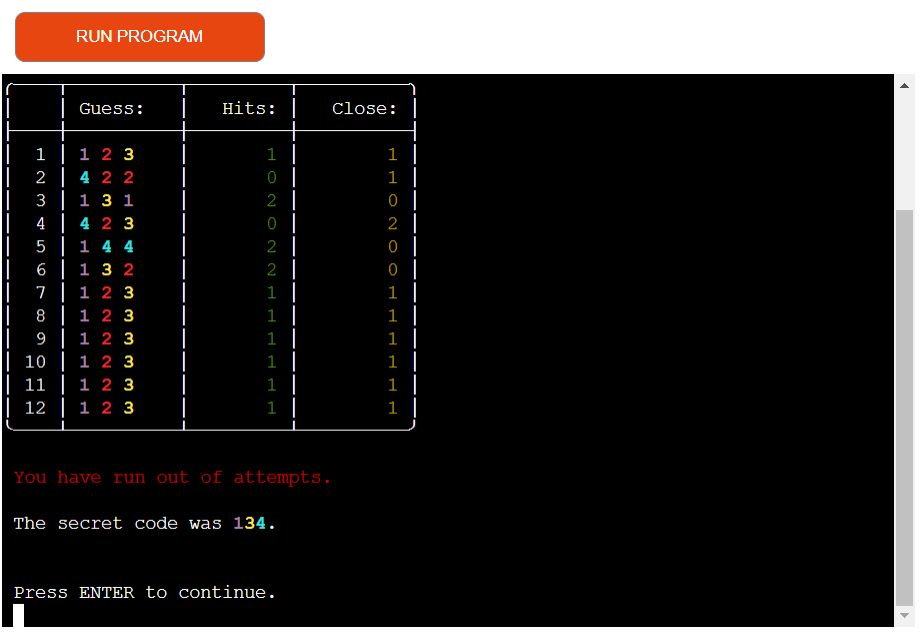
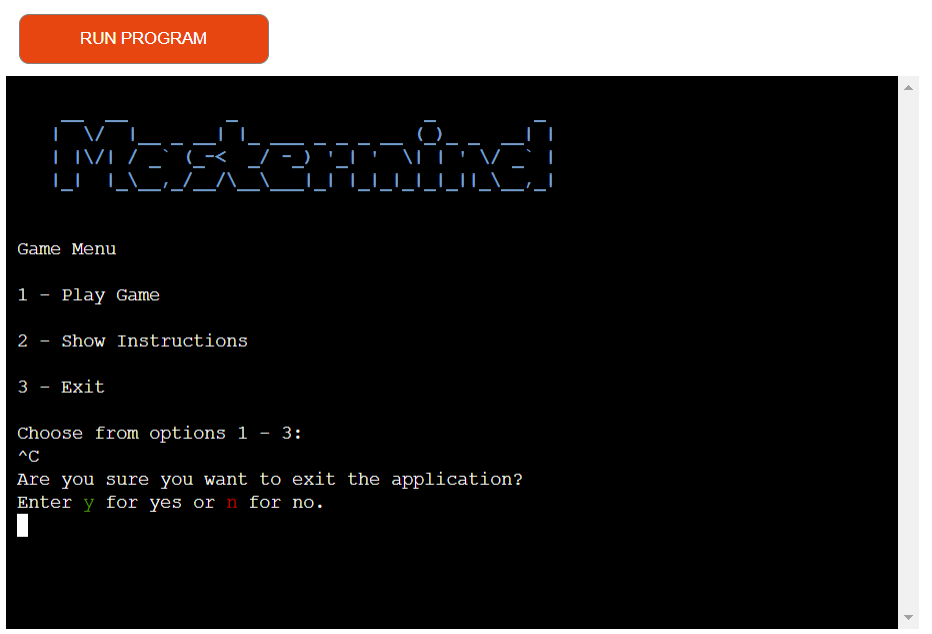
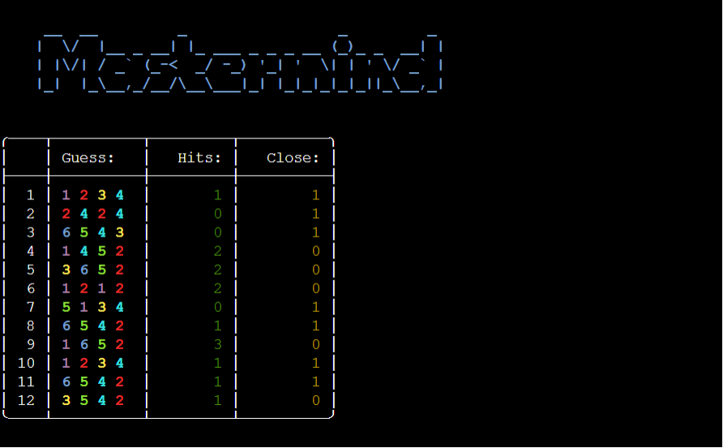
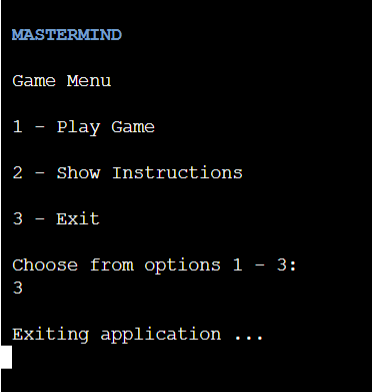
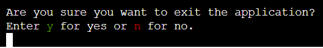
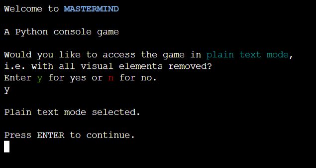

# Testing

> [!NOTE]  
> Return back to the [README.md](README.md) file.

## Python Code Validation

I have used the recommended [PEP8 CI Python Linter](https://pep8ci.herokuapp.com) to validate my Python file.

| Directory | File | CI URL | Screenshot | Notes |
| --- | --- | --- | --- | --- |
|  | run.py | [PEP8 CI](https://pep8ci.herokuapp.com/https://raw.githubusercontent.com/theresaabl/mastermind/main/run.py) |  | |

## Browser Compatibility

I have tested my deployed project on the following browsers to check for compatibility issues.

- [Chrome](https://www.google.com/chrome)
- [Firefox (Developer Edition)](https://www.mozilla.org/firefox/developer)
- [Edge](https://www.microsoft.com/edge)

| Browser | Start Screen | Game Menu | Instructions | Exit App from Menu | Level Menu | Level Introduction | Main Game Page | Game Won | Game Lost | Exit App From Input | Catch Keyboard Interrupt | Notes |
| --- | --- | --- | --- | --- | --- | --- | --- | --- | --- | --- | --- | --- |
| Chrome |  |  |  |  |  |  |  |  |  |  |  | Works as expected |
| Firefox |  |  |  |  |  |  |  |  |  |  |  | Works as expected |
| Edge |  |  |  |  |  |  |  |  |  |  |  | Works as expected |

## Responsiveness

Since the whole frontend of this project is provided by the [Code Institute template](https://github.com/Code-Institute-Org/python-essentials-template) to display the terminal view of the backend application in a modern web browser, it is not very useful to conduct extensive responsiveness testing. The relevant part of this project is the backend application which is displayed in the mock terminal and not the site that provides the mock terminal. 

However, the game is functional across most devices. It can be played without problems on Android mobile devices (even though responsiveness is lacking) but there are known issues with Apple mobile devices. On those, the user cannot input anything in the terminal and therefore the game cannot be played at all.

## Lighthouse Audit

For completeness I have tested my deployed site with the Lighthouse audit tool to check for any major issues. Note that the frontend of this project is not the relevant part.

| Page | Mobile | Desktop | Notes |
| --- | --- | --- | --- |
| Entire site |  |  | Some minor warnings |

## Defensive Programming

🛑🛑🛑🛑🛑🛑🛑🛑🛑🛑-START OF NOTES (to be deleted)

Defensive programming (defensive design) is extremely important!

When building projects that accept user inputs or forms, you should always test the level of security for each.
Examples of this could include (not limited to):

Forms:
- Users cannot submit an empty form
- Users must enter valid email addresses

PP3 (Python-only):
- Users must enter a valid letter/word/string when prompted
- Users must choose from a specific list only

MS3 (Flask) | MS4/PP4/PP5 (Django):
- Users cannot brute-force a URL to navigate to a restricted page
- Users cannot perform CRUD functionality while logged-out
- User-A should not be able to manipulate data belonging to User-B, or vice versa
- Non-Authenticated users should not be able to access pages that require authentication
- Standard users should not be able to access pages intended for superusers

You'll want to test all functionality on your application, whether it's a standard form,
or uses CRUD functionality for data manipulation on a database.
Make sure to include the `required` attribute on any form-fields that should be mandatory.
Try to access various pages on your site as different user types (User-A, User-B, guest user, admin, superuser).

You should include any manual tests performed, and the expected results/outcome.

Testing should be replicable.
Ideally, tests cases should focus on each individual section of every page on the website.
Each test case should be specific, objective, and step-wise replicable.

Instead of adding a general overview saying that everything works fine,
consider documenting tests on each element of the page
(ie. button clicks, input box validation, navigation links, etc.) by testing them in their happy flow,
and also the bad/exception flow, mentioning the expected and observed results,
and drawing a parallel between them where applicable.

Consider using the following format for manual test cases:

Expected Outcome / Test Performed / Result Received / Fixes Implemented

- **Expected**: "Feature is expected to do X when the user does Y."
- **Testing**: "Tested the feature by doing Y."
- (either) **Result**: "The feature behaved as expected, and it did Y."
- (or) **Result**: "The feature did not respond to A, B, or C."
- **Fix**: "I did Z to the code because something was missing."

Use the table below as a basic start, and expand on it using the logic above.

🛑🛑🛑🛑🛑🛑🛑🛑🛑🛑-END OF NOTES (to be deleted)

Defensive programming was manually tested with the below user acceptance testing:

| Page | Expectation | Test | Result | Fix | Screenshot |
| --- | --- | --- | --- | --- | --- |
| Home | | | | | |
| | Feature is expected to do X when the user does Y | Tested the feature by doing Y | The feature behaved as expected, and it did Y | Test concluded and passed |  |
| | Feature is expected to do X when the user does Y | Tested the feature by doing Y | The feature did not respond to A, B, or C. | I did Z to the code because something was missing |  |
| About | | | | | |
| | Feature is expected to do X when the user does Y | Tested the feature by doing Y | The feature behaved as expected, and it did Y | Test concluded and passed |  |
| | Feature is expected to do X when the user does Y | Tested the feature by doing Y | The feature did not respond to A, B, or C. | I did Z to the code because something was missing |  |
| Gallery | | | | | |
| | Feature is expected to do X when the user does Y | Tested the feature by doing Y | The feature behaved as expected, and it did Y | Test concluded and passed |  |
| | Feature is expected to do X when the user does Y | Tested the feature by doing Y | The feature did not respond to A, B, or C. | I did Z to the code because something was missing |  |
| Contact | | | | | |
| | Feature is expected to do X when the user does Y | Tested the feature by doing Y | The feature behaved as expected, and it did Y | Test concluded and passed |  |
| | Feature is expected to do X when the user does Y | Tested the feature by doing Y | The feature did not respond to A, B, or C. | I did Z to the code because something was missing |  |
| repeat for all remaining pages | x | x | x | x | x |

🛑🛑🛑🛑🛑🛑🛑🛑🛑🛑-START OF NOTES (to be deleted)

Another way of performing defensive testing is a simple Pass/Fail for each test.
The assessors prefer the above method, with the full test explained, but this is also acceptable in most cases.

When in doubt, use the above method instead, and delete the table below.

🛑🛑🛑🛑🛑🛑🛑🛑🛑🛑-END OF NOTES (to be deleted)

| Page | User Action | Expected Result | Pass/Fail | Comments |
| --- | --- | --- | --- | --- |
| Home | | | | |
| | Click on Logo | Redirection to Home page | Pass | |
| | Click on Home link in navbar | Redirection to Home page | Pass | |
| Gallery | | | | |
| | Click on Gallery link in navbar | Redirection to Gallery page | Pass | |
| | Load gallery images | All images load as expected | Pass | |
| Contact | | | | |
| | Click on Contact link in navbar | Redirection to Contact page | Pass | |
| | Enter first/last name | Field will accept freeform text | Pass | |
| | Enter valid email address | Field will only accept email address format | Pass | |
| | Enter message in textarea | Field will accept freeform text | Pass | |
| | Click the Submit button | Redirects user to form-dump | Pass | User must click 'Back' button to return |
| Sign Up | | | | |
| | Click on Sign Up button | Redirection to Sign Up page | Pass | |
| | Enter valid email address | Field will only accept email address format | Pass | |
| | Enter valid password (twice) | Field will only accept password format | Pass | |
| | Click on Sign Up button | Asks user to confirm email page | Pass | Email sent to user |
| | Confirm email | Redirects user to blank Sign In page | Pass | |
| Log In | | | | |
| | Click on the Login link | Redirection to Login page | Pass | |
| | Enter valid email address | Field will only accept email address format | Pass | |
| | Enter valid password | Field will only accept password format | Pass | |
| | Click Login button | Redirects user to home page | Pass | |
| Log Out | | | | |
| | Click Logout button | Redirects user to logout page | Pass | Confirms logout first |
| | Click Confirm Logout button | Redirects user to home page | Pass | |
| Profile | | | | |
| | Click on Profile button | User will be redirected to the Profile page | Pass | |
| | Click on the Edit button | User will be redirected to the edit profile page | Pass | |
| | Click on the My Orders link | User will be redirected to the My Orders page | Pass | |
| | Brute forcing the URL to get to another user's profile | User should be given an error | Pass | Redirects user back to own profile |
| repeat for all remaining pages | x | x | x | x |

🛑🛑🛑🛑🛑🛑🛑🛑🛑🛑-START OF NOTES (to be deleted)

Repeat for all other tests, as applicable to your own site.
The aforementioned tests are just an example of a few different project scenarios.

🛑🛑🛑🛑🛑🛑🛑🛑🛑🛑-END OF NOTES (to be deleted)

## User Story Testing

| User Story | Screenshot |
| --- | --- |
| As a user, I would like to play a game of mastermind that is functional and easy to control. |  |
| As a user, I would like to choose a difficulty level. |  |
| As a user, I would like to get clear information on the secret code specifications. |  |
| As a user, I would like to receive clear feedback in case a guess is not valid. |  |
| As a user, I would like to receive clear feedback on how close my guess is to the secret code. |  |
| As a user, I would like to clearly see when I have lost a game. |  |
| As a user, I would like to clearly see when I won a game. |  |
| As a user, I would like to be able to exit the game when I want to. |  |
| As a user, I would like to avoid to accidentally quit the game. |  |
| As a user, I would like to be able to access game instructions. |  |
| As a user, I would like to be able to select a plain text mode to bypass any visual elements. |  |

## Bugs

I have tracked my bugs with **GitHub Issues** :

### Fixed Bugs

All previously closed/fixed bugs can be tracked [here](https://github.com/theresaabl/mastermind/issues?q=is%3Aissue+is%3Aclosed).

| Bug | Status |
| --- | --- |
| [ValueError when playing again after win](https://github.com/theresaabl/mastermind/issues/1) | Closed |
| [Game starts again automatically in level 1](https://github.com/theresaabl/mastermind/issues/2) | Closed |
| [Wrong level description for chosen level](https://github.com/theresaabl/mastermind/issues/3) | Closed |
| [check_guess is case sensitive for alphabetic secret code](https://github.com/theresaabl/mastermind/issues/4) | Closed |
| [clear_screen method only clears visible part in deployed version](https://github.com/theresaabl/mastermind/issues/5) | Closed |
| [User can still press Crtl + C in deployed application](https://github.com/theresaabl/mastermind/issues/6) | Closed |
| [ModuleNotFound error in deployed version ](https://github.com/theresaabl/mastermind/issues/7) | Closed |
| [UnboundLocalError when calling color_secret_code method to guess_list](https://github.com/theresaabl/mastermind/issues/8) | Closed |
| [User allowed to input repeat colors in level 3](https://github.com/theresaabl/mastermind/issues/9) | Closed |

## Unfixed Bugs

Remaining open issues can be tracked [here](https://github.com/theresaabl/mastermind/issues).

| Open Issue | Status |
| --- | --- |
| [Crtl + C crashes application when pressed while time.sleep is running](https://github.com/theresaabl/mastermind/issues/10) | Open |

See also the [Responsiveness](#responsiveness) section for a known issue with Apple mobile devices, where the user cannot input anything in the terminal.