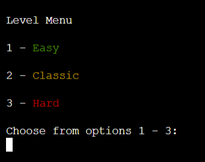
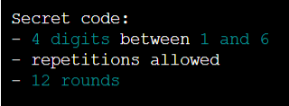
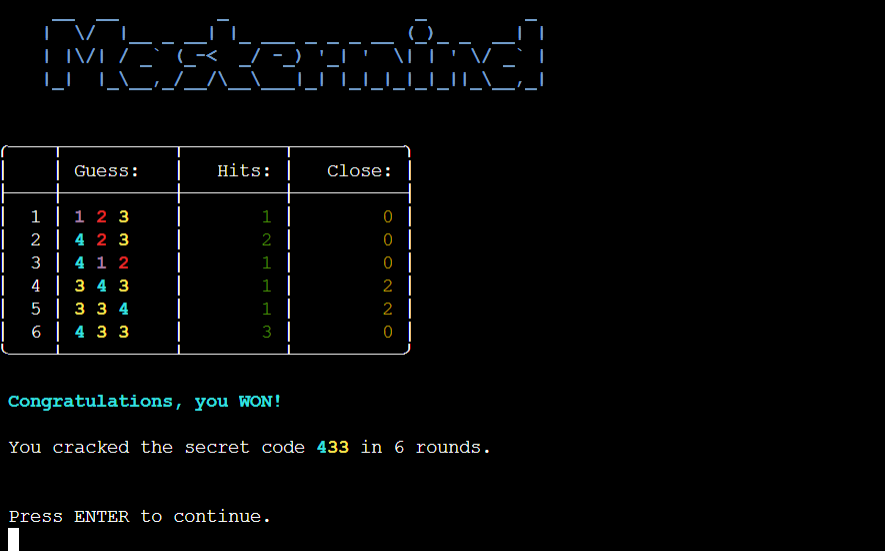
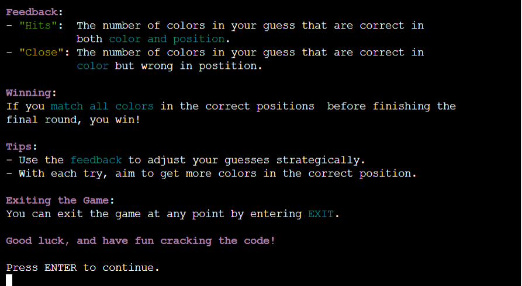
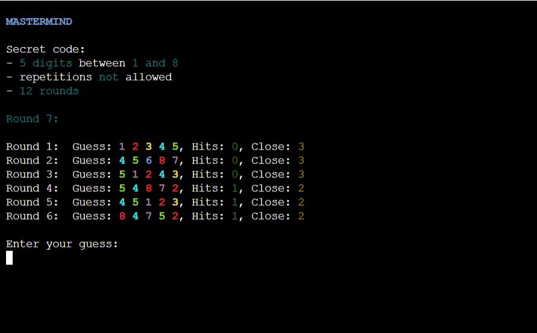

# Testing

> [!NOTE]  
> Return back to the [README.md](README.md) file.

## Python Code Validation

I have used the recommended [PEP8 CI Python Linter](https://pep8ci.herokuapp.com) to validate my Python file.

| Directory | File | CI URL | Screenshot | Notes |
| --- | --- | --- | --- | --- |
|  | run.py | [PEP8 CI](https://pep8ci.herokuapp.com/https://raw.githubusercontent.com/theresaabl/mastermind/main/run.py) |  | |

## Browser Compatibility

I have tested my deployed project on the following browsers to check for compatibility issues.

- [Chrome](https://www.google.com/chrome)
- [Firefox (Developer Edition)](https://www.mozilla.org/firefox/developer)
- [Edge](https://www.microsoft.com/edge)

| Browser | Start Screen | Game Menu | Instructions | Exit App from Menu | Level Menu | Level Introduction | Main Game Page | Game Won | Game Lost | Exit App From Input | Catch Keyboard Interrupt | Notes |
| --- | --- | --- | --- | --- | --- | --- | --- | --- | --- | --- | --- | --- |
| Chrome |  |  |  |  |  |  |  |  |  |  |  | Works as expected |
| Firefox |  |  |  |  |  |  |  |  |  |  |  | Works as expected |
| Edge |  |  |  |  |  |  |  |  |  |  |  | Works as expected |

## Responsiveness

Since the whole frontend of this project is provided by the [Code Institute template](https://github.com/Code-Institute-Org/python-essentials-template) to display the terminal view of the backend application in a modern web browser, it is not very useful to conduct extensive responsiveness testing. The relevant part of this project is the backend application which is displayed in the mock terminal and not the site that provides the mock terminal. 

However, the game is functional across most devices. It can be played without problems on Android mobile devices (even though responsiveness is lacking) but there are known issues with Apple mobile devices. On those, the user cannot input anything in the terminal and therefore the game cannot be played at all.

## Lighthouse Audit

For completeness I have tested my deployed site with the Lighthouse audit tool to check for any major issues. Note that the frontend of this project is not the relevant part.

| Page | Mobile | Desktop | Notes |
| --- | --- | --- | --- |
| Entire site |  |  | Some minor warnings |

## Defensive Programming

## Defensive Programming

Defensive programming was manually tested with the below user acceptance testing:

| Feature | Expectation | Action | Outcome | Fix | Screenshot |
| --- | --- | --- | --- | --- | --- |
| **Start Screen** | When the page is loaded the start screen with a plain text mode request will open | Load the page | Start screen displayed when page loaded | Test concluded and passed |  |
| **Plain Text Mode** | 
| **Logo** | 
| **Plain Text Logo** | 
| **Game Menu** | 
| **Instructions** | 
| **Exit from Menu** | 
| **Level Menu** | 
| **Level Introduction** |
| **Main Game Page** | 
| **Plain Text Main Game Page** | 
| **Secret Code description** | 
| **Round Display** | 
| **Board** | 
| **Plain Text Board** | 
| **Guess Input** | 
| **Last Round Warning** |
| **Game Won** | 
| **Game Lost** | 
| **Exit Game** |
| **Catch KeyboardInterrupt** | 
| **Exit Confirmation** |

## User Story Testing

| User Story | Screenshot |
| --- | --- |
| As a user, I would like to play a game of mastermind that is functional and easy to control. |  |
| As a user, I would like to choose a difficulty level. |  |
| As a user, I would like to get clear information on the secret code specifications. |  |
| As a user, I would like to receive clear feedback in case a guess is not valid. |  |
| As a user, I would like to receive clear feedback on how close my guess is to the secret code. |  |
| As a user, I would like to clearly see when I have lost a game. |  |
| As a user, I would like to clearly see when I won a game. |  |
| As a user, I would like to be able to exit the game when I want to. |  |
| As a user, I would like to avoid to accidentally quit the game. |  |
| As a user, I would like to be able to access game instructions. |  |
| As a user, I would like to be able to select a plain text mode to bypass any visual elements. |  |

## Bugs

I have tracked my bugs with **GitHub Issues** :

### Fixed Bugs

All previously closed/fixed bugs can be tracked [here](https://github.com/theresaabl/mastermind/issues?q=is%3Aissue+is%3Aclosed).

| Bug | Status |
| --- | --- |
| [ValueError when playing again after win](https://github.com/theresaabl/mastermind/issues/1) | Closed |
| [Game starts again automatically in level 1](https://github.com/theresaabl/mastermind/issues/2) | Closed |
| [Wrong level description for chosen level](https://github.com/theresaabl/mastermind/issues/3) | Closed |
| [check_guess is case sensitive for alphabetic secret code](https://github.com/theresaabl/mastermind/issues/4) | Closed |
| [clear_screen method only clears visible part in deployed version](https://github.com/theresaabl/mastermind/issues/5) | Closed |
| [User can still press Crtl + C in deployed application](https://github.com/theresaabl/mastermind/issues/6) | Closed |
| [ModuleNotFound error in deployed version ](https://github.com/theresaabl/mastermind/issues/7) | Closed |
| [UnboundLocalError when calling color_secret_code method to guess_list](https://github.com/theresaabl/mastermind/issues/8) | Closed |
| [User allowed to input repeat colors in level 3](https://github.com/theresaabl/mastermind/issues/9) | Closed |

## Unfixed Bugs

Remaining open issues can be tracked [here](https://github.com/theresaabl/mastermind/issues).

| Open Issue | Status |
| --- | --- |
| [Crtl + C crashes application when pressed while time.sleep is running](https://github.com/theresaabl/mastermind/issues/10) | Open |

See also the [Responsiveness](#responsiveness) section for a known issue with Apple mobile devices, where the user cannot input anything in the terminal.